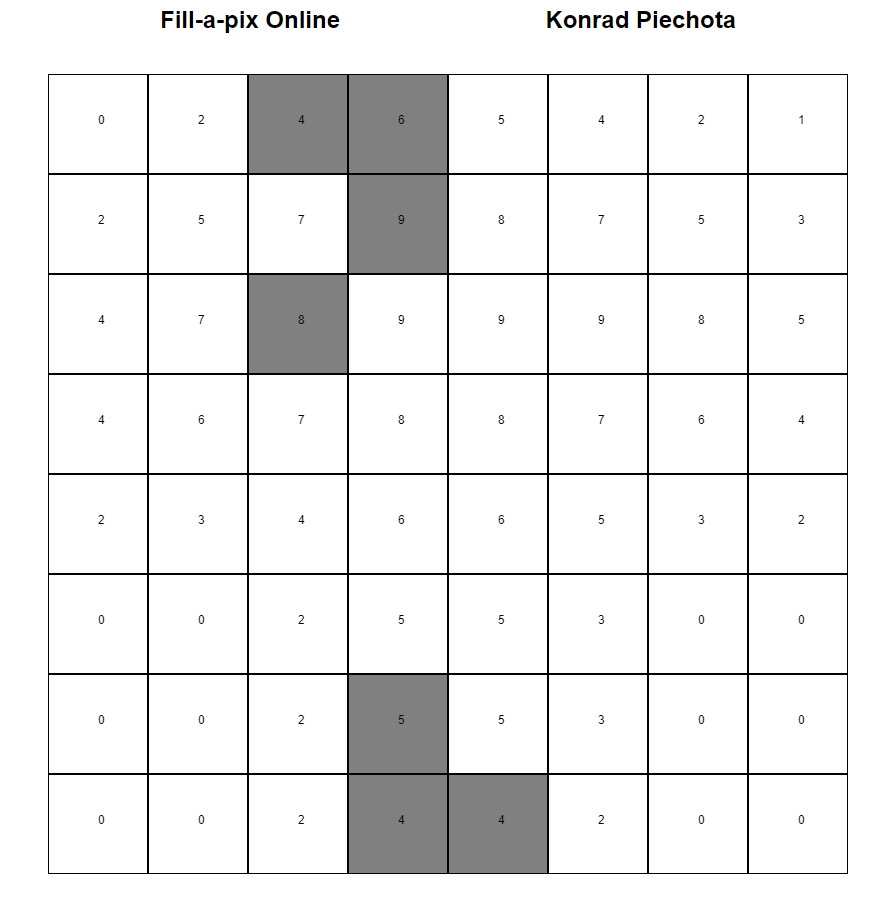

W celu uruchomienia gry w pierwszej kolejności należy upewnić się, że zainstalowane są odpowiednie moduły.
Znajdując się w katalogu z grą można to zrobić komendą

``` pip install -r requirements.txt ```

Brakujące moduły zostaną pobrane.


Następnie można włączyć aplikację, należy upewnić się, że w parametrach znajduje się flaga '-c' lub '--config' z odnośnikiem do odpowiedniego pliku konfiguracyjnego.

```-c config.Config``` - pliki gry będą przechowywane w pamięci aplikacji.

```-c config.StoreInFilesConfig``` pliki gry będą przechowywane w plikach .json


Pod adresem localhost:5000/ zostanie uruchomione menu gry, w którym należy wprowadzić - imię, liczbę kolumn i wierszy (liczby całkowite), oraz wybrac plik graficny z dostepnych.


Zasady gry:

https://www.conceptispuzzles.com/index.aspx?uri=mobile/100001

Próba zamalowania nieodpowiedniej komórki poskutkuje pojawieniem się komunikatu o błędzie.

Gdy wszystkie komórki zostaną zamalowane pojawi się informacja o końcu gry.


Przykład planszy:

